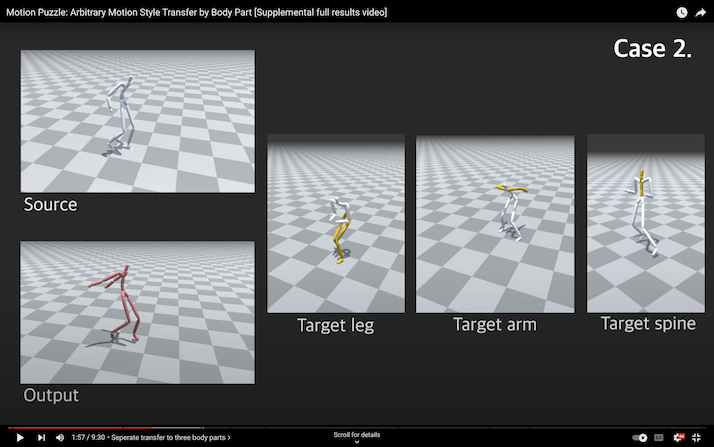

## Motion Puzzle: Arbitrary Motion Style Transfer by Body Part

<p align="center"> <br></p>

> **Motion Puzzle: Arbitrary Motion Style Transfer by Body Part**<br>
> [Deok-Kyeong Jang](https://dk-jang.github.io/), [Soomin Park](https://github.com/soomean), and [Sung-Hee Lee](http://lava.kaist.ac.kr/?page_id=41)<br>
> ACM Transactions on Grahpics (TOG) 2022, presented at ACM SIGGRAPH 2022<br>

> Paper: https://arxiv.org/abs/2202.05274<br>
> Project: https://lava.kaist.ac.kr/?page_id=6467<br>

> **Abstract:** This paper presents Motion Puzzle, a novel motion style transfer network that advances the state-of-the-art in several important respects. The Motion Puzzle is the first that can control the motion style of individual body parts, allowing for local style editing and significantly increasing the range of stylized motions. Designed to keep the human’s kinematic structure, our framework extracts style features from multiple style motions for different body parts and transfers them locally to the target body parts. Another major advantage is that it can transfer both global and local traits of motion style by integrating the adaptive instance normalization and attention modules while keeping the skeleton topology. Thus, it can capture styles exhibited by dynamic movements, such as flapping and staggering, significantly better than previous work. In addition, our framework allows for arbitrary motion style transfer without datasets with style labeling or motion pairing, making many publicly available motion datasets available for training. Our frame- work can be easily integrated with motion generation frameworks to create many applications, such as real-time motion transfer. We demonstrate the advantages of our framework with a number of examples and comparisons with previous work.

## Demo video
Click the figure to watch the demo video. <br/>

[](https://www.youtube.com/watch?v=aBXrGzlsY70)

## Requirements
- Pytorch >= 1.10
- Tensorboard 2.9.0
- numpy 1.21.5
- scipy 1.8.0
- tqdm 4.64.0
- PyYAML 6.0.
- matplotlib 3.5.2

## Installation
Clone this repository and create environment:

```bash
git clone https://github.com/DK-Jang/motion_puzzle.git
cd motion_puzzle
conda create -n motion_puzzle python=3.8
conda activate motion_puzzle
```
First, install PyTorch >= 1.10 from [PyTorch](https://pytorch.org/). \
Install the other dependencies:
```bash
pip install -r requirements.txt 
```

## Datasets and pre-trained networks
- To train the Motion Puzzle network, please download the datasets.
- To run the demo, please download the dataset and pre-trained parameters both.

<b>[Recommend]</b> To download the [train and test datasets](https://www.dropbox.com/s/91dgn3ktc1gdkrm/datasets.zip?dl=0) and the [pre-trained network](https://www.dropbox.com/s/73o0wu4z1f7y5k0/model_ours.zip?dl=0), run the following commands:

```bash
bash download.sh datasets
bash download.sh pretrained-network
```

If you want to generate train and test datasets from the scratch, download the [CMU dataset](https://www.dropbox.com/s/0fyj6d87po7ecqi/cmu.zip?dl=0) from Dropbox. \
Then, place the zip file directory within `database/` and unzip. After that, run the following commands:

```bash
python ./preprocess/generate_mirror_bvh.py    # generate mirrored bvh files
python ./preprocess/generate_dataset.py       # generate train and test dataset
```

## How to run the demo
After downloading the pre-trained parameterss, you can run the demo. \
We use the post-processed results (`*_fixed.bvh`) for all the demo.

- <b>Motion style transfer.</b> To generate motion style transfer results, run following commands:
```bash
python test.py --config ./model_ours/info/config.yaml \         # model configuration path
               --content ./datasets/cmu/test_bvh/127_21.bvh \   # input content bvh file
               --style ./datasets/cmu/test_bvh/142_21.bvh \     # input style bvh file
               --output_dir ./output                            # output directory
```
Generated motions(bvh format) will be placed under `./output`. <br>
`*.bvh`: ground-truth content and style motion, <br>
`*_recon.bvh`: content reconstruction motion, <br>
`Style_*_Content_*.bvh`: translated output motion, <br>
`Style_*_Content_*_fixed.bvh`: translated output motion with post-processing including foot-sliding removal. <br>

- <b>Separate transfer to three body parts.</b> To transfer arbitrary unseen styles from 3 target motions, each for a different body part, to a single source motion. \
  You can easily change the style of each body part by changing the `--style_leg` and `--style_spine` and `--style_arm` bvh file names. \
  In addition, by modifying slightly the `forward` function of `Generator`, our model is able to transfer styles to maximum **five body parts** of source motion.
```bash
python test_3bodyparts.py --config model_ours/info/config.yaml \
                          --content ./datasets/edin_locomotion/test_bvh/locomotion_walk_sidestep_000_000.bvh \   # input content
                          --style_leg ./datasets/Xia/test_bvh/old_normal_walking_002.bvh \     # input style leg 
                          --style_spine ./datasets/Xia/test_bvh/old_normal_walking_002.bvh \   # input style spine
                          --style_arm ./datasets/Xia/test_bvh/childlike_running_003.bvh \      # input style arm
                          --output_dir ./output_3bodyparts
```
Generated motions(bvh format) will be placed under `./output_3bodyparts`. <br>
`*.bvh`: ground-truth content and 3 target style motion, <br>
`Leg_*_Spine_*_Arm_*_Content_*.bvh`: translated output motion, <br>
`Leg_*_Spine_*_Arm_*_Content_*_fixed.bvh`: translated output motion with post-processing. <br>

- <b>Per-part style interpolation.</b> Interpolation between two different style motions. This example is all body parts interpolation with linear weight 0.5. \
  You can easily change the code to interpolate one or 2, 3 body parts' style.
```bash
python test_interpolation.py --config model_ours/info/config.yaml \
                             --content ./datasets/cmu/test_bvh/41_02.bvh \   # input content bvh file
                             --style1 datasets/cmu/test_bvh/137_11.bvh \     # input style1 bvh file
                             --style2 datasets/cmu/test_bvh/55_07.bvh \      # input style2 bvh file
                             --weight 0.5 \                                  # interpolation weight
                             --output_dir ./output_interpolation
```
Generated motions(bvh format) will be placed under `./output_interpolation`. <br>
`*.bvh`: ground-truth content and two style motions for interpolation, <br>
`All_*_Style1_*_Style2_*_Content_*_.bvh`:  interpolated output motion, <br>
`All_*_Style1_*_Style2_*_Content_*_fixed.bvh`: interpolated output motion with post-processing. <br>

### Todo
- Quantitative evaluation


## How to train
To train Motion Puzzle networks from the scratch, run the following commands. \
Training takes about 5-6 hours on two 2080ti GPUs. Please see `configs/config.yaml` for training arguments.
```bash
python train.py --config configs/config.yaml
```
Trained networks will be placed under `./model_ours/`

## Modification
We found that **root information** did not play a significant role in the performance of our framework. Therefore, in this github project, we removed the root information from the input representation. Also, we removed the loss function for preserving the root motion within the total loss.

## Citation
If you find this work useful for your research, please cite our paper:

```
@article{jang2022motion,
  title={Motion Puzzle: Arbitrary Motion Style Transfer by Body Part},
  author={Jang, Deok-Kyeong and Park, Soomin and Lee, Sung-Hee},
  journal={ACM Transactions on Graphics (TOG)},
  publisher={ACM New York, NY}
}
```

## Acknowledgements
This repository contains pieces of code from the following repositories: \
[A Deep Learning Framework For Character Motion Synthesis and Editing](http://theorangeduck.com/page/deep-learning-framework-character-motion-synthesis-and-editing). \
[Unpaired Motion Style Transfer from Video to Animation](https://github.com/DeepMotionEditing/deep-motion-editing). \
In addition, all mocap datasets are taken from the work of [Holden et al](http://theorangeduck.com/page/deep-learning-framework-character-motion-synthesis-and-editing).


